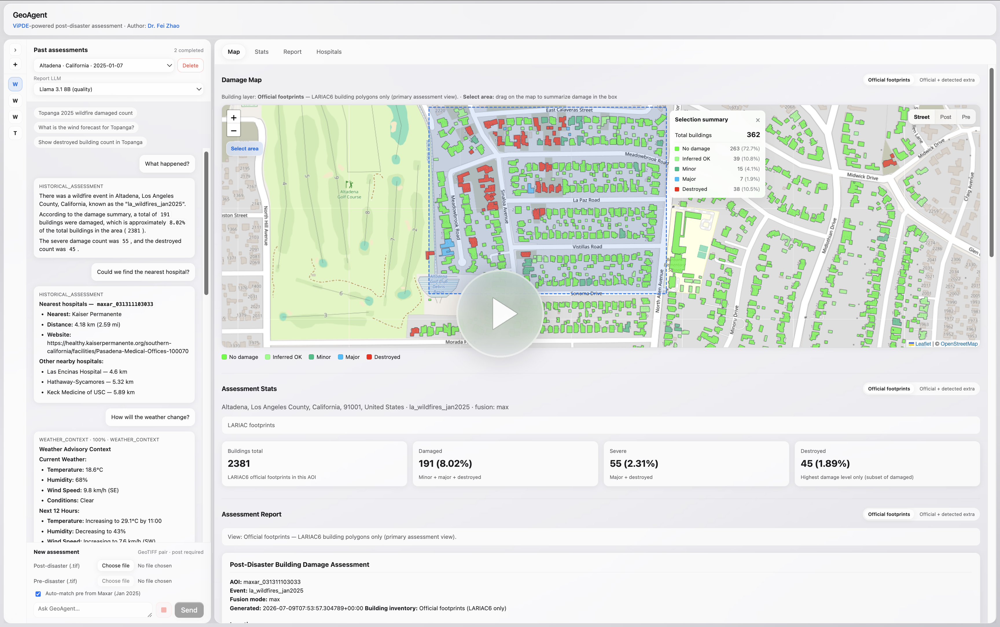

# RapidResponseAgent

**Multimodal AI Agent for Post-Disaster Assessment**

When a wildfire or other disaster moves through a city, emergency teams do not need another model demo. They need a clear picture of what burned, where people and crews should go next, and answers they can trust—without waiting for a full perception rerun every time someone asks a follow-up.

**RapidResponseAgent** is built for that loop. Start from a **post-disaster** scene—pre-event imagery is optional. The system can automatically find a matching pre-disaster source, align the pair, and turn the result into durable assessment artifacts. A grounded conversation then sits on top of those artifacts: damage counts and directional priority, nearby hospitals / fire / police / shelters, weather context, short reports, and public emergency guidance—scoped to one AOI at a time, on your own machine.

### From pixels to a decision surface

The story of a session is deliberate:

1. **See** — Upload or select a **post-disaster** GeoTIFF. Pre-event imagery is **not required**: the agent can search for an appropriate pre scene (Maxar Open → local Maxar → NAIP → USGS → NOAA, …), align it to the post image, run **ViPDE** damage scoring at scale, and fuse predictions with official footprints.
2. **Verify** — a **Vision-Language Agent** (Visual Verifier) challenges uncertain or inconsistent cases with multimodal chips; reviewers can **Agree** or **Reject**, and those preferences can later steer the Verifier via DPO / LoRA.
3. **Hold still** — verified results become reusable artifacts (stats, maps, facilities, manifests). Expensive GPU work stays behind a checkpoint.
4. **Ask** — downstream tools and local LLMs answer multi-turn questions over that frozen evidence. Numbers come from assessment tools; doctrine comes from cited public SOPs; vague prompts get a clarify menu instead of a confident wrong answer.

Perception and reasoning are not two disconnected apps. They are one workflow: heavy vision once, light reasoning many times—while sensitive imagery stays **on-premises**.

Perception backbone: **[ViPDE / RapidDamageAssessment](https://github.com/feizhao19/RapidDamageAssessment)** — licensing and citation follow that project ([README](https://github.com/feizhao19/RapidDamageAssessment/blob/main/README.md)).

### Demo

<p align="center">
  <a href="https://www.youtube.com/watch?v=lIQxRoqIp14">
    
  </a>
</p>

Watch the walkthrough: **[YouTube — RapidResponseAgent demo](https://www.youtube.com/watch?v=lIQxRoqIp14)**

### Demo snapshots

<table align="center" cellpadding="0" cellspacing="10">
  <tr>
    <td align="center" valign="middle" width="25%">
      <div style="background-color:#F1F1F4; padding:10px;">
        
      </div>
    </td>
    <td align="center" valign="middle" width="25%">
      <div style="background-color:#F1F1F4; padding:10px;">
        
      </div>
    </td>
    <td align="center" valign="middle" width="25%">
      <div style="background-color:#F1F1F4; padding:10px;">
        
      </div>
    </td>
    <td align="center" valign="middle" width="25%">
      <div style="background-color:#F1F1F4; padding:10px;">
        
      </div>
    </td>
  </tr>
</table>

Demo geography centers on **Los Angeles wildfires (Jan 2025)** Maxar/NOAA cases (e.g. Altadena / Topanga-area quads such as `maxar_031311103033`).

---

## Architecture

RapidResponseAgent is **artifact-centric**: perception writes durable AOI outputs; chat never invents those outputs from memory.

```text
Post imagery (+ optional pre)
    → Auto pre-match & align (if needed)
    → ViPDE + footprint fusion
    → Visual Verifier (+ optional human Agree/Reject → DPO)
    → Assessment artifacts (stats · map · facilities · report)
    → Tool-routed chat
         ├─ Case tools   (counts, 3×3 priority, hospitals/fire/police/shelters, weather)
         ├─ Case RAG     (this AOI’s indexed artifacts)
         └─ Knowledge RAG (public FEMA / Cal OES / Ready.gov SOPs, with Sources)
```

GPU-heavy steps run in the assessment job; the chat path is rules-first tool routing plus local LLMs for wording. Ambiguous questions clarify. We will **gradually release** more of this stack as licensing allows.

---

## What it does

| Stage | What you get |
|-------|----------------|
| **Assess** | Start from **post** GeoTIFF (pre optional): auto-find & align pre when missing → ViPDE damage perception → fuse with **Overture** footprints (LARIAC optional) |
| **Verify** | Llama Vision review of mismatches / damage; Agree–Reject preferences for optional DPO LoRA |
| **Orient** | Map with pre/post overlays, damage polygons, region stats; chat deep-links to hospitals and fire / police / shelters |
| **Decide** | Tool-grounded Q&A: damage counts, which area first (3×3 impact grid), critical facilities, weather, short report |
| **Advise** | Knowledge guidance from curated public SOPs under `knowledge/sops/` (citations required; not a substitute for official orders) |

---

## Repository layout

| Path | Role |
|------|------|
| `geoagent/` | Agent orchestration package — available by request; contact the author (see License) |
| `knowledge/sops/` | Curated **public** emergency-guidance markdown (FEMA / Cal OES / Ready.gov / NWS) for Knowledge RAG |
| `perception/` | ViPDE inference entrypoints, configs, docs; proprietary package lives under `vipde/` (local only) |
| `web/` | FastAPI backend + React / Vite / Leaflet UI |
| `scripts/` | Offline pipeline CLIs (align, fusion, VLM, reports, knowledge index, model download) — may be omitted in some distributions |
| `data/` | Local imagery, aligned AOIs, sessions, indexes, Chroma store (not in git) |
| `.cache/` | Hugging Face / torch caches (not in git) |

---

## Stack

| Layer | Choices |
|-------|---------|
| Perception | **ViPDE** (SAM / ViT-B), PyTorch, CUDA |
| Fusion / GIS | rasterio, geopandas, **Overture** footprints (LARIAC optional) |
| Orchestration | LangGraph + LangChain |
| LLMs | Local Llama 3.2 **1B** / Llama 3.1 **8B** / Llama 3.2 **11B Vision** (Hugging Face) |
| Case RAG | sentence-transformers over assessment artifacts |
| Knowledge RAG | **Chroma** + sentence-transformers over `knowledge/sops/` |
| Backend | FastAPI |
| Frontend | React 18, TypeScript, Vite, Leaflet |
| External | OpenStreetMap Overpass (**hospitals, fire, police, shelters**), weather APIs, Maxar ARD + NOAA ERI imagery |

---

## Quick start (Web UI)

Use **two terminals**, then open **http://127.0.0.1:5173**.

### First-time setup

```bash
cd /path/to/RapidResponseAgent
conda activate sam
pip install -r requirements.txt
pip install -r web/requirements.txt

cp .env.example .env   # set HF_TOKEN (accept Meta Llama licenses on Hugging Face)
cd web/frontend && npm install && cd ../..
```

ViPDE weights and the proprietary `perception/vipde` package must be installed locally (see [`perception/README.md`](perception/README.md)). They are **not** shipped in git.

### Terminal 1 — API (port 8000)

```bash
cd /path/to/RapidResponseAgent
conda activate sam
set -a && source .env && set +a
# Optional if present: source scripts/project_env.sh   # keeps HF weights under ./.cache
./web/run_api.sh
```

Health check: `curl http://127.0.0.1:8000/api/health` → `{"status":"ok"}`

### Terminal 2 — Frontend (port 5173)

```bash
cd /path/to/RapidResponseAgent/web/frontend
npm run dev
```

In chat, use **Report LLM** to pick **1B / 8B / 11B Vision**.

### Single-server mode (optional)

```bash
cd web/frontend && npm run build
cd ../..
./web/run_api.sh
```

Open **http://127.0.0.1:8000** (serves `web/frontend/dist`).

More detail: [`web/README.md`](web/README.md).

---

## Typical UI workflow

1. Start a chat session and select an indexed AOI (or upload imagery for a **new assessment**).
2. Wait for the pipeline job (`aligning` → `running` → `completed`).
3. Explore the map: pre/post imagery, building polygons by damage class, hospitals.
4. Run **VLM Building Review** on footprints and/or predicted damage; use **Agree** / **Reject** to label Verifier recommendations.
5. Open **stats / report / hospitals** panels as needed.
6. Ask grounded questions, for example:
   - `how many destroyed buildings?`
   - `which area should be handled first?` (3×3 directional priority)
   - `where is the nearest fire station?` / police / shelter / hospital (click **Show on map**)
   - `What does a Red Flag Warning mean?` or `how to mitigate wildfire impacts` (public SOP guidance + Sources)
   - weather outlook or a short assessment report

Ambiguous asks (e.g. “tell me something useful”) prompt a **clarify** menu instead of guessing case damage numbers.

---

## Chat tools & knowledge RAG

After assessment artifacts exist, chat is a **tool loop**, not an open-ended essay generator. The router picks a tool; the LLM only phrases the result.

| Tool | Example asks |
|------|----------------|
| `get_damage_stats` | Damage counts; which NW/N/NE… cell to handle first |
| `find_nearest_hospitals` | Nearest hospital / ER |
| `find_nearest_facilities` | Fire station, police, emergency shelter |
| `weather_context` | Current forecast / fire weather conditions |
| `query_guidance` | FEMA PDA levels, NIMS/ICS, mitigation, FMAG, mutual aid |
| `generate_report` | Short assessment narrative |
| `query_historical` | Case overview when the ask is clearly about this assessment |

Public SOP corpus: [`knowledge/sops/`](knowledge/sops/). With the full `geoagent` package:

```bash
pip install -r requirements.txt   # includes chromadb
PYTHONPATH=. python scripts/build_knowledge_rag_index.py
```

Facility locations come from **OpenStreetMap** and may be incomplete—verify with official authorities before operational use.

---

## Visual Verifier preferences → DPO (optional)

Human feedback turns VLM review into a preference-learning loop:

1. **Default answer** — the Verifier’s ensemble recommendation is shown in the UI.
2. **Counterfactual** — the system always prepares the opposite damage hypothesis so both accept and reject pools stay non-empty.
3. **Agree / Reject** — Agree keeps the default as chosen and the counterfactual as rejected; Reject flips them. All ensemble views are labeled relative to the preferred recommendation.
4. **Export** — preference JSONL under `data/vlm_preferences/` expands to `accept × reject` pairs (`data/vlm_dpo/dpo_pairs.jsonl`).
5. **Train & apply** — LoRA DPO on Llama 3.2 11B Vision; set `VLM_DPO_ADAPTER` to the adapter directory and restart the API so the next VLM review loads it.

```bash
pip install -r requirements-dpo.txt
python scripts/run_vlm_dpo_pipeline.py --export-only   # prepare pairs
python scripts/run_vlm_dpo_pipeline.py --train         # CUDA machine
export VLM_DPO_ADAPTER=/path/to/RapidResponseAgent/data/vlm_dpo/runs/latest/adapter
```

Shared helpers live in `web/api/vlm_preferences.py` and `web/api/vlm_dpo_dataset.py`. More detail: [`scripts/README.md`](scripts/README.md). Offline training CLIs may be omitted in some public snapshots; contact the author if you need the full script set.

---

## Models & environment

| UI label | Hugging Face id |
|----------|-----------------|
| Llama 3.2 1B (fast) | `meta-llama/Llama-3.2-1B-Instruct` |
| Llama 3.1 8B (quality) | `meta-llama/Meta-Llama-3.1-8B-Instruct` |
| Llama 3.2 11B Vision | `meta-llama/Llama-3.2-11B-Vision-Instruct` (~20 GB VRAM) |

- Conda env **`sam`** for ViPDE + API (`./web/run_api.sh` uses `sam` if no `.venv`)
- Put **`HF_TOKEN`** in `.env` after accepting Meta licenses
- Prefer caching weights under `RapidResponseAgent/.cache/` (via `scripts/project_env.sh` or `HF_HOME`)
- Optional Visual Verifier adapter: set **`VLM_DPO_ADAPTER`** (see `.env.example`) after DPO training

---

## License

Terms below mirror the **ViPDE / RapidDamageAssessment** policy. When in doubt, treat the upstream docs as authoritative:
[RapidDamageAssessment README — License](https://github.com/feizhao19/RapidDamageAssessment/blob/main/README.md#license).

### License summary

This work is released for:

- ✓ Academic research
- ✓ Government evaluation (federal, state, and local agencies)
- ✓ Educational purposes
- ✓ Nonprofit disaster-response and emergency-management organizations

**Restricted without prior written permission:** commercial use, contractor use, third-party redistribution, and deployment in commercial or operational products.

**Model weights** (e.g. `vipde_vitb_damage_v1.pth`) are **not** included in this repository. Request access by email (below).

### Which document applies to you?

| If you are… | Read this |
|-------------|-----------|
| Researcher, student, government evaluator, or qualifying nonprofit user | [`perception/LICENSE`](perception/LICENSE) (RGHL v1.0) — permitted use and restrictions; same spirit as [RapidDamageAssessment `LICENSE`](https://github.com/feizhao19/RapidDamageAssessment/blob/main/LICENSE) |
| Company, contractor, or anyone seeking commercial / operational use or model weights | [`perception/COMMERCIAL_LICENSING.md`](perception/COMMERCIAL_LICENSING.md) — then email the author for written approval; see also [RapidDamageAssessment `COMMERCIAL_LICENSING.md`](https://github.com/feizhao19/RapidDamageAssessment/blob/main/COMMERCIAL_LICENSING.md) |

### Background

RapidResponseAgent and ViPDE support disaster-response research and evaluation with public-sector and nonprofit emergency-management partners. The license above is intended to keep research, education, and humanitarian/public-safety evaluation available while preventing unauthorized commercial use, contractor redistribution, or operational deployment without explicit approval.

**Contact:** Fei Zhao — [zhaof.thu@gmail.com](mailto:zhaof.thu@gmail.com) · [github.com/feizhao19](https://github.com/feizhao19)  
(Weights access, commercial licensing, and other permissions not covered by [`perception/LICENSE`](perception/LICENSE))

---

## Acknowledgments & citation

RapidResponseAgent builds on **ViPDE** for building-damage perception. If you use this agent, ViPDE, or related weights, please **cite** the ViPDE paper (and SAM when applicable). Full citation blocks are in the [ViPDE README](https://github.com/feizhao19/RapidDamageAssessment/blob/main/README.md#acknowledgments).

> Fei Zhao, Chengcui Zhang, Runlin Zhang, and Tianyang Wang. **Visual Prompt Learning of Foundation Models for Post-Disaster Damage Evaluation**. *Remote Sensing* **17**, no. 10: 1664, 2025.
>
> DOI: https://doi.org/10.3390/rs17101664

```bibtex
@article{zhao2025visual,
  title={Visual Prompt Learning of Foundation Models for Post-Disaster Damage Evaluation},
  author={Zhao, Fei and Zhang, Chengcui and Zhang, Runlin and Wang, Tianyang},
  journal={Remote Sensing},
  volume={17},
  number={10},
  pages={1664},
  year={2025},
  publisher={MDPI},
  doi={10.3390/rs17101664}
}
```
