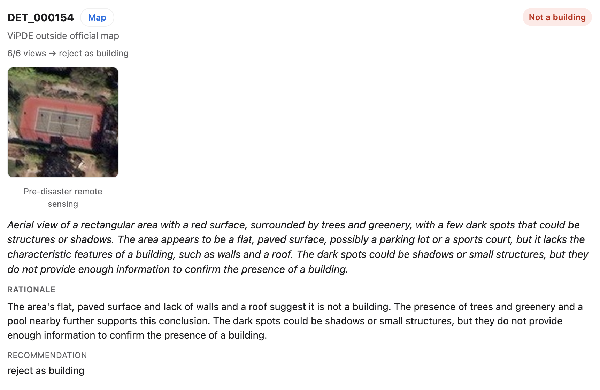
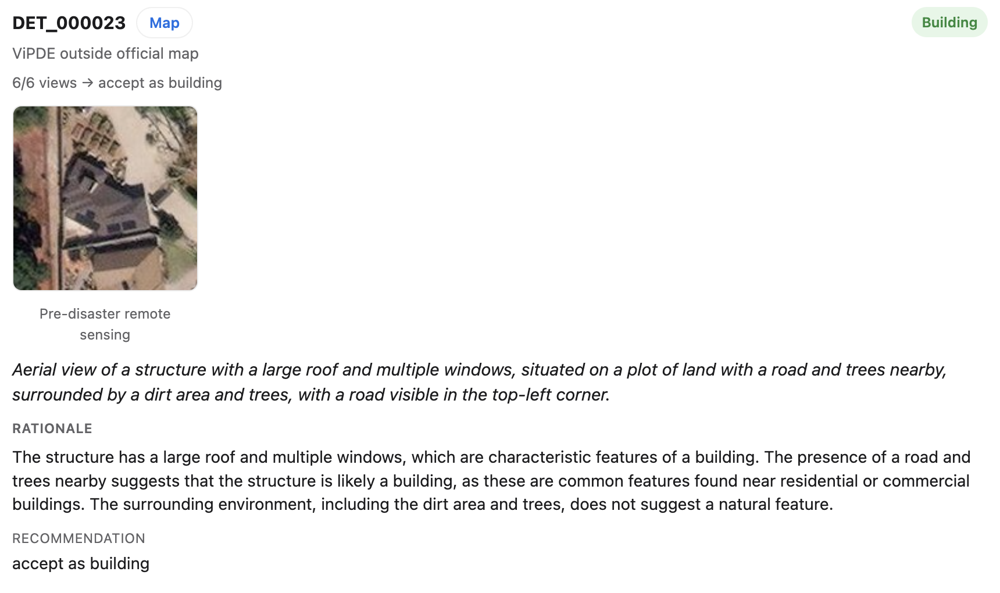
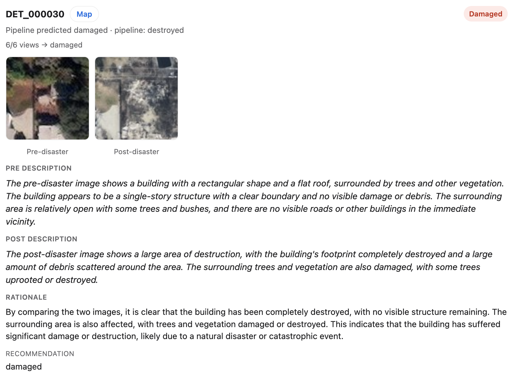
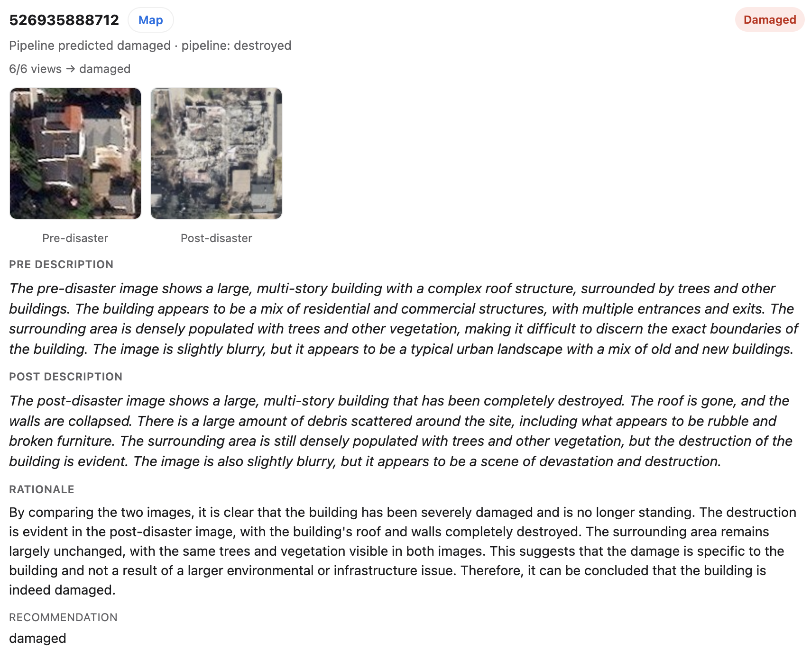

# RapidResponseAgent

**Multimodal AI Agent for Post-Disaster Assessment**

RapidResponseAgent is an agentic runtime that transforms raw remote-sensing imagery into actionable disaster intelligence. Rather than treating perception and reasoning as independent stages, it combines vision models, verification agents, geospatial analytics, and language models into a unified workflow for emergency response.

The pipeline begins with **ViPDE**, which performs large-scale building damage assessment from paired pre- and post-disaster imagery. Instead of accepting every prediction as final, a **Vision-Language Agent** reviews uncertain or inconsistent cases, verifies discrepancies using multimodal reasoning, and refines assessment results before they become reusable disaster assessment artifacts.

These verified artifacts are then consumed by downstream reasoning agents, enabling low-latency multi-turn question answering, infrastructure analysis, and report generation without rerunning expensive visual inference.

### Demo

<p align="center">
  <a href="https://www.youtube.com/watch?v=lIQxRoqIp14">
    
  </a>
</p>

Watch the walkthrough: **[YouTube — RapidResponseAgent demo](https://www.youtube.com/watch?v=lIQxRoqIp14)**

### Demo snapshots

<table align="center" cellpadding="0" cellspacing="10">
  <tr>
    <td align="center" valign="middle" width="25%">
      <div style="background-color:#F1F1F4; padding:10px;">
        
      </div>
    </td>
    <td align="center" valign="middle" width="25%">
      <div style="background-color:#F1F1F4; padding:10px;">
        
      </div>
    </td>
    <td align="center" valign="middle" width="25%">
      <div style="background-color:#F1F1F4; padding:10px;">
        
      </div>
    </td>
    <td align="center" valign="middle" width="25%">
      <div style="background-color:#F1F1F4; padding:10px;">
        
      </div>
    </td>
  </tr>
</table>

Perception backbone: **[ViPDE / RapidDamageAssessment](https://github.com/feizhao19/RapidDamageAssessment)** — licensing and citation follow that project ([README](https://github.com/feizhao19/RapidDamageAssessment/blob/main/README.md)).

---

## Architecture

RapidResponseAgent follows an **artifact-centric orchestration** architecture for heterogeneous geospatial AI workloads.

The runtime coordinates:

- **ViPDE** for large-scale building damage assessment
- **VLM verification agents** for discrepancy detection and multimodal reasoning
- Structured damage analytics
- Geospatial facility lookup
- **RAG + locally deployed LLMs** over cached assessment artifacts
- Persistent session memory, tool traces, and manifest-driven checkpoints for reproducible multi-step analysis

By separating GPU-intensive perception from lightweight reasoning, the system supports efficient iterative analysis while keeping sensitive disaster imagery entirely **on-premises**.

We will **gradually release** more of this work over time (including withheld pipeline components and packaging where licensing allows).

---

## What it does

| Capability | Description |
|------------|-------------|
| **Damage assessment** | Align pre/post imagery → run **ViPDE** pixel damage perception → fuse with official building footprints (LARIAC) |
| **VLM review** | Llama Vision double-checks footprint mismatches and “destroyed” labels with pre/post chips |
| **Map + panels** | Leaflet map with imagery overlays, damage polygons, hospitals, region stats, and assessment report |
| **Grounded chat** | Multi-turn Q&A scoped to the active AOI: damage stats, hospitals, weather, historical RAG, report generation |
| **New assessments** | Upload post (and optional pre) GeoTIFF, or auto-match pre from a local Maxar catalog, and run the full pipeline |

Demo geography centers on **Los Angeles wildfires (Jan 2025)** Maxar/NOAA cases (e.g. Altadena / Topanga-area quads such as `maxar_031311103033`).

---

## Repository layout

| Path | Role |
|------|------|
| `geoagent/` | Agents, LangGraph AOI pipeline, runtime (memory / planner / tool router), skills, tools |
| `perception/` | ViPDE inference entrypoints, configs, docs; proprietary package lives under `vipde/` (local only) |
| `web/` | FastAPI backend + React / Vite / Leaflet UI |
| `scripts/` | Offline pipeline CLIs (align, fusion, VLM, reports, model download) — may be omitted in some distributions |
| `data/` | Local imagery, aligned AOIs, sessions, indexes (not in git) |
| `.cache/` | Hugging Face / torch caches (not in git) |

---

## Stack

| Layer | Choices |
|-------|---------|
| Perception | **ViPDE** (SAM / ViT-B), PyTorch, CUDA |
| Fusion / GIS | rasterio, geopandas, LARIAC footprints |
| Orchestration | LangGraph + LangChain |
| LLMs | Local Llama 3.2 **1B** / Llama 3.1 **8B** / Llama 3.2 **11B Vision** (Hugging Face) |
| RAG | sentence-transformers over assessment artifacts |
| Backend | FastAPI |
| Frontend | React 18, TypeScript, Vite, Leaflet |
| External | OpenStreetMap Overpass (hospitals), weather APIs, Maxar ARD + NOAA ERI imagery |

---

## Quick start (Web UI)

Use **two terminals**, then open **http://127.0.0.1:5173**.

### First-time setup

```bash
cd /path/to/RapidResponseAgent
conda activate sam
pip install -r requirements.txt
pip install -r web/requirements.txt

cp .env.example .env   # set HF_TOKEN (accept Meta Llama licenses on Hugging Face)
cd web/frontend && npm install && cd ../..
```

ViPDE weights and the proprietary `perception/vipde` package must be installed locally (see [`perception/README.md`](perception/README.md)). They are **not** shipped in git.

### Terminal 1 — API (port 8000)

```bash
cd /path/to/RapidResponseAgent
conda activate sam
set -a && source .env && set +a
# Optional if present: source scripts/project_env.sh   # keeps HF weights under ./.cache
./web/run_api.sh
```

Health check: `curl http://127.0.0.1:8000/api/health` → `{"status":"ok"}`

### Terminal 2 — Frontend (port 5173)

```bash
cd /path/to/RapidResponseAgent/web/frontend
npm run dev
```

In chat, use **Report LLM** to pick **1B / 8B / 11B Vision**.

### Single-server mode (optional)

```bash
cd web/frontend && npm run build
cd ../..
./web/run_api.sh
```

Open **http://127.0.0.1:8000** (serves `web/frontend/dist`).

More detail: [`web/README.md`](web/README.md).

---

## Typical UI workflow

1. Start a chat session and select an indexed AOI (or upload imagery for a **new assessment**).
2. Wait for the pipeline job (`aligning` → `running` → `completed`).
3. Explore the map: pre/post imagery, building polygons by damage class, hospitals.
4. Open **stats / report / hospitals** panels as needed.
5. Ask grounded questions, e.g. damage counts for the active AOI, nearest hospitals, weather outlook, or a comparison to a past case.

---

## Models & environment

| UI label | Hugging Face id |
|----------|-----------------|
| Llama 3.2 1B (fast) | `meta-llama/Llama-3.2-1B-Instruct` |
| Llama 3.1 8B (quality) | `meta-llama/Meta-Llama-3.1-8B-Instruct` |
| Llama 3.2 11B Vision | `meta-llama/Llama-3.2-11B-Vision-Instruct` (~20 GB VRAM) |

- Conda env **`sam`** for ViPDE + API (`./web/run_api.sh` uses `sam` if no `.venv`)
- Put **`HF_TOKEN`** in `.env` after accepting Meta licenses
- Prefer caching weights under `RapidResponseAgent/.cache/` (via `scripts/project_env.sh` or `HF_HOME`)

---

## License

Terms below mirror the **ViPDE / RapidDamageAssessment** policy. When in doubt, treat the upstream docs as authoritative:
[RapidDamageAssessment README — License](https://github.com/feizhao19/RapidDamageAssessment/blob/main/README.md#license).

### License summary

This work is released for:

- ✓ Academic research
- ✓ Government evaluation (federal, state, and local agencies)
- ✓ Educational purposes
- ✓ Nonprofit disaster-response and emergency-management organizations

**Restricted without prior written permission:** commercial use, contractor use, third-party redistribution, and deployment in commercial or operational products.

**Model weights** (e.g. `vipde_vitb_damage_v1.pth`) are **not** included in this repository. Request access by email (below).

### Which document applies to you?

| If you are… | Read this |
|-------------|-----------|
| Researcher, student, government evaluator, or qualifying nonprofit user | [`perception/LICENSE`](perception/LICENSE) (RGHL v1.0) — permitted use and restrictions; same spirit as [RapidDamageAssessment `LICENSE`](https://github.com/feizhao19/RapidDamageAssessment/blob/main/LICENSE) |
| Company, contractor, or anyone seeking commercial / operational use or model weights | [`perception/COMMERCIAL_LICENSING.md`](perception/COMMERCIAL_LICENSING.md) — then email the author for written approval; see also [RapidDamageAssessment `COMMERCIAL_LICENSING.md`](https://github.com/feizhao19/RapidDamageAssessment/blob/main/COMMERCIAL_LICENSING.md) |

### Background

RapidResponseAgent and ViPDE support disaster-response research and evaluation with public-sector and nonprofit emergency-management partners. The license above is intended to keep research, education, and humanitarian/public-safety evaluation available while preventing unauthorized commercial use, contractor redistribution, or operational deployment without explicit approval.

**Contact:** Fei Zhao — [zhaof.thu@gmail.com](mailto:zhaof.thu@gmail.com) · [github.com/feizhao19](https://github.com/feizhao19)  
(Weights access, commercial licensing, and other permissions not covered by [`perception/LICENSE`](perception/LICENSE))

---

## Acknowledgments & citation

RapidResponseAgent builds on **ViPDE** for building-damage perception. If you use this agent, ViPDE, or related weights, please **cite** the ViPDE paper (and SAM when applicable). Full citation blocks are in the [ViPDE README](https://github.com/feizhao19/RapidDamageAssessment/blob/main/README.md#acknowledgments).

> Fei Zhao, Chengcui Zhang, Runlin Zhang, and Tianyang Wang. **Visual Prompt Learning of Foundation Models for Post-Disaster Damage Evaluation**. *Remote Sensing* **17**, no. 10: 1664, 2025.
>
> DOI: https://doi.org/10.3390/rs17101664

```bibtex
@article{zhao2025visual,
  title={Visual Prompt Learning of Foundation Models for Post-Disaster Damage Evaluation},
  author={Zhao, Fei and Zhang, Chengcui and Zhang, Runlin and Wang, Tianyang},
  journal={Remote Sensing},
  volume={17},
  number={10},
  pages={1664},
  year={2025},
  publisher={MDPI},
  doi={10.3390/rs17101664}
}
```
