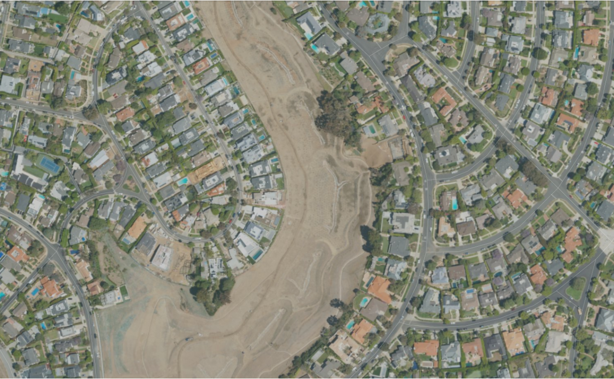
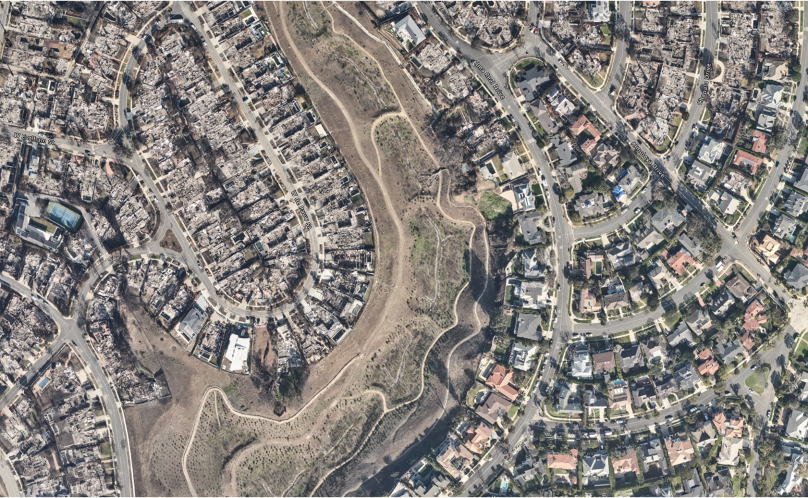
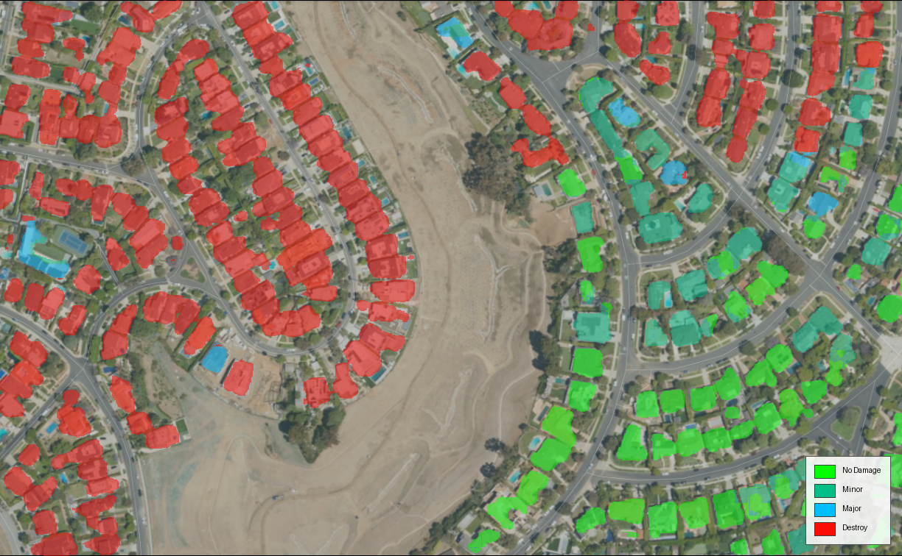
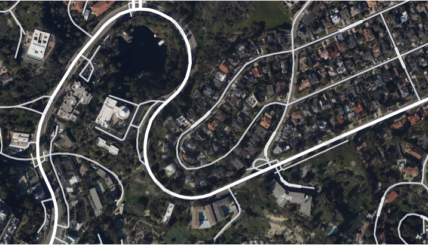
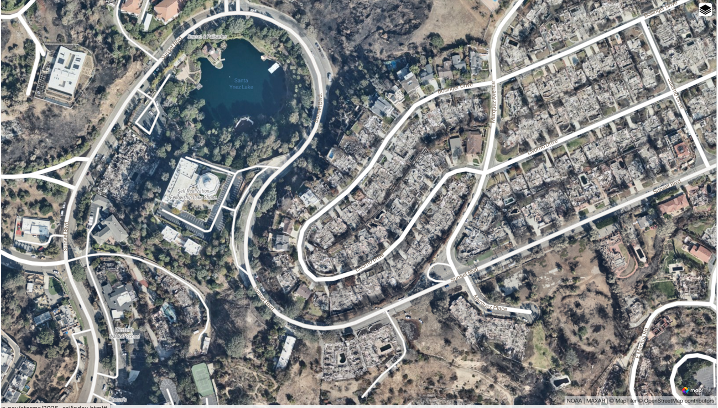
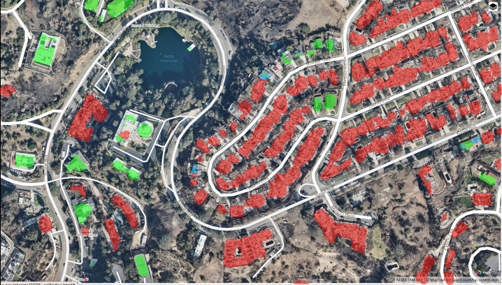

# ViPDE — Visual Prompt Damage Evaluation Framework

**ViPDE** (Visual Prompt Damage Evaluation) is a foundation model-based framework for post-disaster building damage assessment from remote sensing imagery.

Given a pair of pre-disaster and post-disaster satellite images, ViPDE leverages visual prompt learning and contrastive feature analysis to generate a pixel-wise building damage map with four damage levels: No Damage, Minor Damage, Major Damage, and Destroyed.

<small>

**ViPDE** extends the **Segment Anything Model (SAM)** from Meta AI. If you use this code or models, please cite **both** the SAM paper and our work below (see [Acknowledgments](#acknowledgments)). This repo is optimized for **NVIDIA GPU (CUDA)** and **Apple M-series Mac (MPS)** inference.

</small>


## Sample test data

Two [NOAA ERI](https://storms.ngs.noaa.gov/) pre/post image pairs from the **California Fire (2025)** event, together with ViPDE damage assessment results for **Potero Canyon** and **Marquez Knolls** in Pacific Palisades, Los Angeles, CA 90272. For an **interactive demo** with **slider comparison** and **community switching**, see the [**ViPDE project page**](https://feizhao19.github.io/#project-building-damage).

**Potero Canyon, Pacific Palisades, LA, CA** (~106 acres; [George Wolfberg Park at Potero Canyon, Alma Real Dr](https://www.google.com/maps/search/?api=1&query=George+Wolfberg+Park+at+Potero+Canyon,+Alma+Real+Dr,+Pacific+Palisades,+CA+90272))

| Pre-disaster | Post-disaster | Predicted damage overlay |
|:---:|:---:|:---:|
|  |  |  |

**Marquez Knolls, Pacific Palisades, LA, CA** (~175 acres; [17080 Sunset Blvd](https://www.google.com/maps/search/?api=1&query=17080+Sunset+Blvd,+Pacific+Palisades,+CA+90272))

| Pre-disaster | Post-disaster | Predicted damage overlay |
|:---:|:---:|:---:|
|  |  |  |

**Benchmark — Marquez Knolls** (`--img-size 1024`, Test-Time Augmentation / TTA with `--tta-rotate`)

| Platform | Hardware | macOS / OS | Runtime |
|----------|----------|------------|---------|
| macOS | MacBook Pro **M5 Pro** (MPS) | **26.5.1 (25F80)** | **~3 s** |

| File | Role |
|------|------|
| `docs/Potero_LA_pre_disaster.png` | Potero Canyon — pre-disaster reference |
| `docs/Potero_LA_post_disaster.png` | Potero Canyon — post-disaster imagery |
| `docs/Potero_pre_damage_overlay_legend.png` | Potero Canyon — prediction overlay with legend |
| `docs/Marquez_LA_pre_disaster.png` | Marquez Knolls — pre-disaster reference |
| `docs/Marquez_LA_post_disaster.png` | Marquez Knolls — post-disaster imagery |
| `docs/Marquez_post_damage_overlay.png` | Marquez Knolls — prediction overlay |

**Imagery source — NOAA Emergency Response Imagery (ERI)**

- High-resolution post-disaster aerial photos from NOAA aircraft after federally declared disasters.
- California Fire 2025 imagery is available.
- Portal: https://storms.ngs.noaa.gov/
- Viewer: https://oceanservice.noaa.gov/hazards/emergency-response-imagery.html

## Project layout

> In **RapidResponseAgent**, this package lives under `perception/` (vision models). Agent orchestration lives in `geoagent/` (available by request from the author; see the root README License contact).

```
perception/
├── vipde/
│   ├── models/              # ViPDE model
│   └── utils/               # Preprocessing, device selection, TTA, visualization
├── scripts/
│   ├── predict.py           # CLI inference
│   └── check_device.py      # Print available devices (cuda / mps / cpu)
├── checkpoints/
│   └── vipde_vitb_damage_v1.pth   # place weights here (not tracked by git)
├── docs/                    # sample images and Mac guide
├── configs/inference.yaml
├── requirements.txt
└── environment.yml
```

## Prerequisites

- Python 3.10
- Conda (recommended)
- **Weights**: `checkpoints/vipde_vitb_damage_v1.pth` (~380 MB)

Clone the repo:

```bash
git clone https://github.com/feizhao19/RapidDamageAssessment.git
cd RapidDamageAssessment
```

---

## Installation — Linux + NVIDIA GPU

**Requirements**: Linux with an NVIDIA GPU, CUDA-capable driver, Python 3.10.

```bash
conda env create -f environment.yml
conda activate sam

# Install PyTorch with CUDA (match the wheel to your CUDA version)
pip3 install torch torchvision --index-url https://download.pytorch.org/whl/cu126

pip install -e .
```

Verify the GPU is visible:

```bash
python scripts/check_device.py
# resolve_device('auto') -> cuda (...)
```

### Quick test (Linux / NVIDIA)

```bash
python scripts/predict.py \
  --pre-image docs/Marquez_LA_pre_disaster.png \
  --post-image docs/Marquez_LA_post_disaster.png \
  --weights checkpoints/vipde_vitb_damage_v1.pth \
  --output-dir outputs/linux_test \
  --device auto \
  --precision fp32 \
  --gpu 0
```

With rotation Test-Time Augmentation (TTA):

```bash
python scripts/predict.py \
  --pre-image docs/Marquez_LA_pre_disaster.png \
  --post-image docs/Marquez_LA_post_disaster.png \
  --weights checkpoints/vipde_vitb_damage_v1.pth \
  --output-dir outputs/linux_test_tta \
  --device auto \
  --precision fp32 \
  --gpu 0 \
  --tta-rotate
```

| Option | Linux recommendation |
|--------|----------------------|
| `--device` | `auto` or `cuda` |
| `--precision` | `fp32` (or `fp16` / `auto` for faster CUDA runs) |
| `--gpu` | GPU index, e.g. `--gpu 0` |
| `--tta-rotate` | optional Test-Time Augmentation (TTA) to improve prediction quality |

---

## Installation — macOS (Apple M-series)

**Requirements**: **Apple M-series chip** (M1–M5+), 16 GB RAM recommended. Intel Macs are not tested or officially supported.

```bash
conda env create -f environment.yml
conda activate sam

# arm64 + MPS build (do not install the CUDA wheel)
pip install torch torchvision

pip install -e .
```

Verify MPS:

```bash
python scripts/check_device.py
# resolve_device('auto') -> mps (Apple Silicon GPU)
```

### Quick test (macOS)

```bash
python scripts/predict.py \
  --pre-image docs/Marquez_LA_pre_disaster.png \
  --post-image docs/Marquez_LA_post_disaster.png \
  --weights checkpoints/vipde_vitb_damage_v1.pth \
  --output-dir outputs/mac_test \
  --device auto \
  --precision fp32
```

With rotation Test-Time Augmentation (TTA) — ~3 s on MacBook Pro M5 Pro, macOS 26.5.1 (25F80):

```bash
python scripts/predict.py \
  --pre-image docs/Marquez_LA_pre_disaster.png \
  --post-image docs/Marquez_LA_post_disaster.png \
  --weights checkpoints/vipde_vitb_damage_v1.pth \
  --output-dir outputs/mac_test_tta \
  --device auto \
  --precision fp32 \
  --tta-rotate
```

| Option | Mac recommendation |
|--------|-------------------|
| `--device` | `auto` or `mps` |
| `--precision` | `fp32` (MPS has no fp16) |
| `--gpu` | **do not pass** (CUDA only) |
| `--tta-rotate` | safe to use on M-series chips |

---

## Outputs

`--output-dir` is created automatically. A standard run writes:

| File | Description |
|------|-------------|
| `pre_input.png` / `post_input.png` | Saved input copies |
| `damage_mask.png` | Class index mask (uint8) |
| `pre_damage_overlay.png` | Pre-disaster image + mask overlay |
| `post_damage_overlay.png` | Post-disaster image + mask overlay |
| `pre_damage_overlay_legend.png` | Overlay with color legend |
| `post_damage_overlay_legend.png` | Overlay with color legend |

`damage_mask.png` uses the following class labels:

| Class | Label |
|-------|-------|
| 0 | Background |
| 1 | No damage |
| 2 | Minor damage |
| 3 | Moderate damage |
| 4 | Severe damage / destroyed |

### Test-Time Augmentation (TTA)

With `--tta-rotate`, the script also runs **Test-Time Augmentation (TTA)**: the pre/post image pair is inferred under multiple geometric views — **90° rotations** (default `--tta-mode rotate`, 4 views) or **rotations plus horizontal flips** (`--tta-mode d4`, 8 views). Each view is mapped back to the original orientation, and predictions are fused with **soft voting** (average class probabilities, then argmax). This reduces sensitivity to image orientation and yields a more **robust** damage mask at the cost of extra runtime.

TTA outputs use the same file names as the standard pass and are saved under `<output-dir>/tta/`.

## CLI reference

```bash
python scripts/predict.py \
  --pre-image  <path> \
  --post-image <path> \
  --weights    checkpoints/vipde_vitb_damage_v1.pth \
  --output-dir outputs/my_run \
  --device     auto \
  --precision  fp32 \
  --img-size   1024 \
  --resample   lanczos \
  --tta-rotate \
  --tta-mode   rotate
```

| Argument | Default | Description |
|----------|---------|-------------|
| `--weights` | `checkpoints/vipde_vitb_damage_v1.pth` | Full ViPDE checkpoint |
| `--device` | `auto` | `auto` / `cuda` / `mps` / `cpu` |
| `--precision` | `fp32` | `fp32` / `fp16` / `auto` (fp16 only on CUDA) |
| `--gpu` | — | CUDA device index (Linux/NVIDIA only) |
| `--img-size` | 1024 | Longest-side resize; pad to square |
| `--resample` | lanczos | `lanczos` / `cubic` / `area` / `nearest` |
| `--tta-rotate` | off | Run Test-Time Augmentation (TTA); results under `tta/` |
| `--tta-mode` | `rotate` | TTA strategy: `rotate` (4 views) or `d4` (8 views) |
| `--model-name` | `vit_b` | `vit_b` / `vit_l` / `vit_h` |

## Python API

```python
import torch
from vipde import ViPDE
from vipde.utils import preprocess_image_tensor, resolve_device

IMG_SIZE = 1024  # same default as --img-size and configs/inference.yaml
device = resolve_device("auto")
pixel_mean = pixel_std = [0.5, 0.5, 0.5]

weights = "checkpoints/vipde_vitb_damage_v1.pth"
pre_path = "docs/Marquez_LA_pre_disaster.png"
post_path = "docs/Marquez_LA_post_disaster.png"

model = ViPDE.from_pretrained(
    weights_path=weights,
    backbone_name="vit_b",
    num_classes=5,
)
model.to(device).eval()

pre = preprocess_image_tensor(pre_path, IMG_SIZE, pixel_mean, pixel_std).to(device)
post = preprocess_image_tensor(post_path, IMG_SIZE, pixel_mean, pixel_std).to(device)

with torch.no_grad():
    logits = model(pre, post)  # [1, 5, H, W]
    pred = logits.argmax(dim=1)
```

## Platform summary

| | Linux + NVIDIA | macOS (Apple M-series) |
|--|----------------|------------------------|
| Conda env | `sam` | `sam` |
| PyTorch | CUDA wheel (`cu126`) | pip arm64 + MPS |
| `--device auto` | `cuda` | `mps` |
| `--precision` | `fp32` (or `fp16` on CUDA) | `fp32` |
| `--gpu` | `--gpu 0` | not used |
| TTA runtime | a few seconds (A100) | ~3 s (M5 Pro, macOS 26.5.1) |

## Acknowledgments

This project is built on top of Meta's **Segment Anything Model (SAM)**. We thank the SAM authors for releasing the model, code, and pretrained weights.

If you use this repository, ViPDE, or related weights, please **cite both** the SAM paper and our paper below.

### This work (ViPDE)

> Fei Zhao, Chengcui Zhang, Runlin Zhang, and Tianyang Wang. **Visual Prompt Learning of Foundation Models for Post-Disaster Damage Evaluation**. *Remote Sensing* **17**, no. 10: 1664, 2025.

- DOI: https://doi.org/10.3390/rs17101664

```bibtex
@article{zhao2025visual,
  title={Visual Prompt Learning of Foundation Models for Post-Disaster Damage Evaluation},
  author={Zhao, Fei and Zhang, Chengcui and Zhang, Runlin and Wang, Tianyang},
  journal={Remote Sensing},
  volume={17},
  number={10},
  pages={1664},
  year={2025},
  publisher={MDPI},
  doi={10.3390/rs17101664}
}
```

### SAM (foundation model)

> Alexander Kirillov, Eric Mintun, Nikhila Ravi, Hanzi Mao, Chloe Rolland, Laura Gustafson, Tete Xiao, Spencer Whitehead, Alexander C. Berg, Wan-Yen Lo, Piotr Dollár, and Ross Girshick. **Segment Anything**. *IEEE/CVF International Conference on Computer Vision (ICCV)*, 2023.

- Paper (arXiv): https://arxiv.org/abs/2304.02643
- Code: https://github.com/facebookresearch/segment-anything

```bibtex
@inproceedings{kirillov2023segment,
  title={Segment Anything},
  author={Kirillov, Alexander and Mintun, Eric and Ravi, Nikhila and Mao, Hanzi and Rolland, Chloe and Gustafson, Laura and Xiao, Tete and Whitehead, Spencer and Berg, Alexander C and Lo, Wan-Yen and Doll{\'a}r, Piotr and Girshick, Ross},
  booktitle={Proceedings of the IEEE/CVF International Conference on Computer Vision (ICCV)},
  year={2023}
}
```

The `segment-anything` package is subject to Meta's [Apache 2.0 license](https://github.com/facebookresearch/segment-anything/blob/main/LICENSE); comply with those terms when using SAM components.

## License

### License summary

This repository is released for:

- ✓ Academic research
- ✓ Government evaluation (federal, state, and local agencies)
- ✓ Educational purposes
- ✓ Nonprofit disaster-response and emergency-management organizations

**Restricted without prior written permission:** commercial use, contractor use, third-party redistribution, and deployment in commercial or operational products.

**Model weights** (e.g. `vipde_vitb_damage_v1.pth`) are not included in this repository. Request access by email (below).

### Which document applies to you?

| If you are… | Read this |
|-------------|-----------|
| Researcher, student, government evaluator, or qualifying nonprofit user | **[LICENSE](LICENSE)** — permitted use and restrictions |
| Company, contractor, or anyone seeking commercial / operational use or model weights | **[COMMERCIAL_LICENSING.md](COMMERCIAL_LICENSING.md)** — then email the author for written approval |

### Background

This project supports disaster-response research and evaluation with public-sector and nonprofit emergency-management partners. The license above is intended to keep the code available for research, education, and humanitarian/public-safety evaluation while preventing unauthorized commercial use, contractor redistribution, or operational deployment without explicit approval.

**Contact:** Fei Zhao — [zhaof.thu@gmail.com](mailto:zhaof.thu@gmail.com) · [github.com/feizhao19](https://github.com/feizhao19)  
(Weights access, commercial licensing, and other permissions not covered by [LICENSE](LICENSE))
